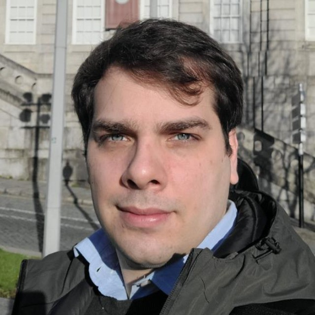
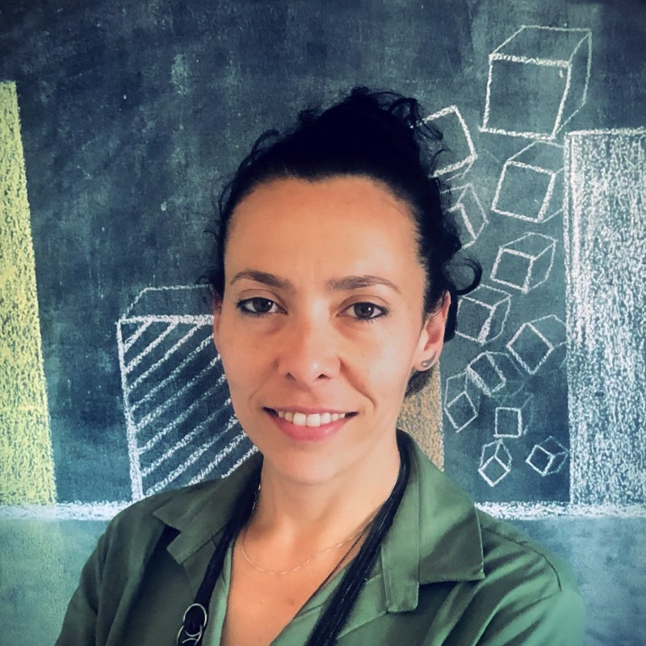
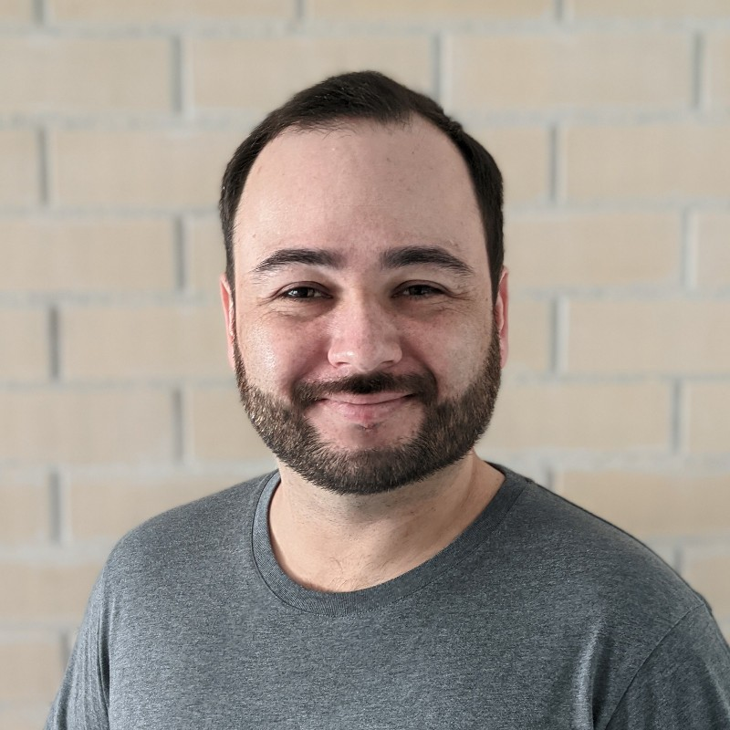

    <a href="https://www.linkedin.com/in/armandodauer/" target="_blank">Armando Dauer (CEO)</a>

Description Armando. PhD candidate in transport systems at the University of Coimbra, Portugal. Research applications of artificial intelligence (AI) in transport and mobility of the future. Especially interested in machine learning (ML) algorithms, computer vision and intelligent transportation systems (ITS).

---

    <a href="https://www.linkedin.com/in/juliana-carvalho-cortes-silva/" target="_blank">Juliana Carvalho (CCO)</a>

PhD candidate in Transport Systems at the Faculty of Engineering, University of Porto, and INESC TEC. Drawing from diverse experiences in rights-based policies, sustainability, climate change, education, and collaborative planning, Juliana offers a comprehensive skill set and an interdisciplinary perspective to her work.

---

    <a href="https://www.linkedin.com/in/tamagusko/" target="_blank">Tiago Tamagusko (CTO)</a>

 
PhD candidate in transport systems at the University of Coimbra, Portugal. Research applications of artificial intelligence (AI) in transport and mobility of the future. Especially interested in machine learning (ML) algorithms, computer vision, and intelligent transportation systems (ITS).

---
